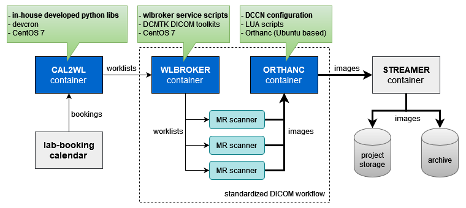

# DCCN DICOM dataflow

_NOTE: this package has strong dependency on the DCCN research facility, such as the project-based storage and properly configured MRI scanners._

A schematic illustration of the automatic DCCN dataflow is shown in the figure below:



The dataflow involves four services, three of which (indicated by the blue blocks) are packaged and described in this repository:

- __CAL2WL__: A (cron-like) in-house developed service running periodically to convert the lab-booking events (containing the date-time slot, the project number and the subject/session labels) into standard [DICOM worklists](https://pacsbootcamp.com/dicom-modality-worklist/). See: `./dscker/cal2wl/`
- __WLBROKER__: A light-weight DICOM worklist broker using the `wlmscpfs` program of the freely available [DCMTK toolkit](http://dicom.offis.de) to push the worklists to the scanners.
- __ORTHANC__: A freely available DICOM PACS server that can receive DICOM data pushed from the scanners and present it on the network with a much simpler RESTful API for further routing (i.e. to the right subject/session folder on project storage). See the [Orthanc](http://www.orthanc-server.com/) website for more details.

The wlbroker and the orthanc services create an industry standard DICOM workflow environment for the scanners (any number of any kind), similar to what can be found in hospitals. The service for streaming data from the Orthanc server to project storage and our data archive is provided as a separate package called [__Streamer__](https://github.com/Donders-Institute/streamer). All services are provided as [docker](http://docker.com) containers.

## Requirements 

1. [docker-engine](https://www.docker.com/products/docker-engine)
1. [docker-compose](https://docs.docker.com/compose/)

## Getting start

### 1. Checkout this package from GitHub
 
```bash
$ git clone https://github.com/Donders-Institute/dicom-dataflow.git
$ cd dicom-dataflow
```

### 2. Start docker containers

Instruction of starting docker containers is documented [here](docker/README.md).
